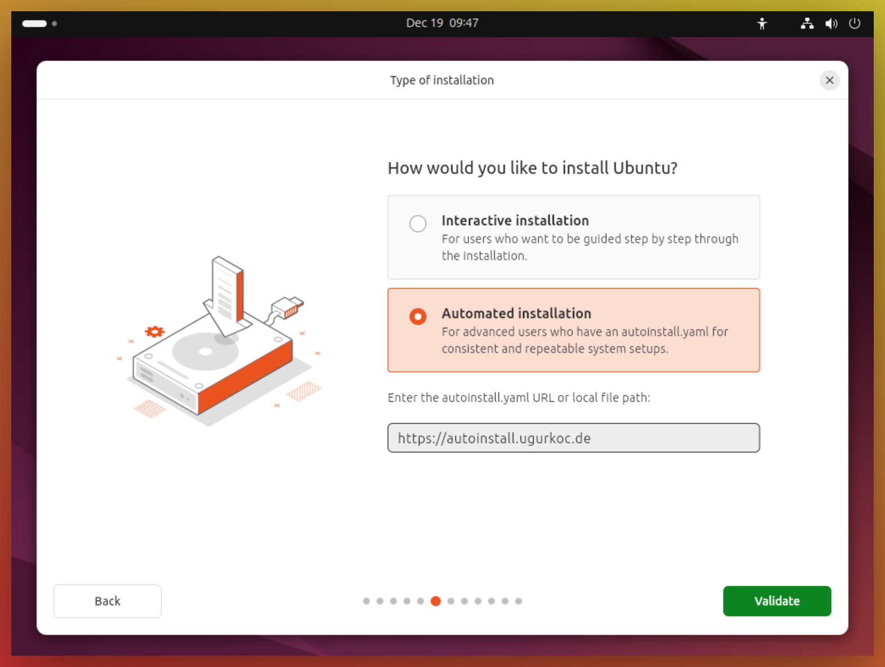
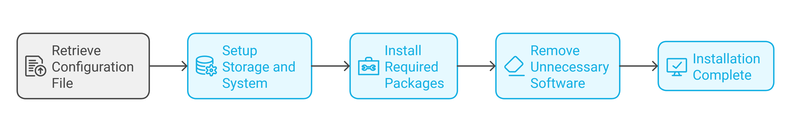

<h1 align="center">🐧 LinuxESP: Automating Ubuntu Deployments</h1>

LinuxESP is an automated Ubuntu Linux deployment solution that mimics the Windows Autopilot Enrollment Status Page (ESP) experience. It simplifies the process of enrolling Ubuntu workstations into Intune and deploying Microsoft Defender for Endpoint (MDE), eliminating the need for manual installation of tools like Intune Portal, MDE, and Edge, while also supporting customizable development environments.

<p align="center">
  
</p>

## 📑 Table of Contents
- [📑 Table of Contents](#-table-of-contents)
- [🔄 What is Autoinstall?](#-what-is-autoinstall)
- [🎯 Overview](#-overview)
- [✨ Features](#-features)
- [🛠️ Installation Components Breakdown](#️-installation-components-breakdown)
  - [Base Configuration](#base-configuration)
  - [Package Installation](#package-installation)
  - [Microsoft Enterprise Integration](#microsoft-enterprise-integration)
  - [System Cleanup](#system-cleanup)
- [📋 Prerequisites](#-prerequisites)
- [📖 Usage](#-usage)
  - [How it Works](#how-it-works)
- [⚙️ Customization Examples](#️-customization-examples)
  - [Adding Snap Packages](#adding-snap-packages)
  - [Installing Additional apt Packages](#installing-additional-apt-packages)
  - [Removing Additional Bloatware](#removing-additional-bloatware)
- [🤝 Contributing](#-contributing)
- [📄 License](#-license)

## 🔄 What is Autoinstall?

"Autoinstall" is a feature in Ubuntu Server and, as of version 24.04, also supported in Ubuntu Desktop. It allows fully automated installation of the operating system using a pre-configured YAML file. This file specifies how the system should be installed and configured, including partitioning, user setup, installed packages, and custom scripts. It replaces the traditional manual installation process, providing consistency and speed for large-scale deployments.

LinuxESP leverages the autoinstall functionality to streamline the setup of Ubuntu systems for enterprise use. By defining a detailed configuration file (`autoinstall.yaml`), administrators can ensure that systems are set up identically every time, without requiring manual intervention.

## 🎯 Overview

This project provides an automated installation configuration that:
- Updates and configures Ubuntu Linux
- Deploys Microsoft Management and Security tools (Intune Portal, Microsoft Defender for Endpoint, Microsoft Edge)
- Installs applications (customizable via Snap or apt)
- Removes unnecessary default applications
- Configures the system for enterprise use

## ✨ Features

- 🔒 Secure LVM-based storage configuration
- 🛡️ Microsoft Defender for Endpoint (MDE) integration
- 📱 Microsoft Intune management capabilities
- 💻 Customizable software deployment
- 🧹 Bloatware removal
- 🔄 Automated updates

## 🛠️ Installation Components Breakdown

> **Note**: This configuration is just an example. You can download and customize it to your needs. You just have to host it somewhere that is accessible for the device.

The `autoinstall.yaml` configuration performs the following steps:

### Base Configuration
- Sets up LVM storage layout
- Configures German keyboard layout with US English locale
- Disables root access
- Configures basic system settings

### Package Installation
- **Base Utilities**: curl, wget
- **Customizable Software Deployment**:
  - Via Snap Store (examples in current config):
    - Visual Studio Code
    - Postman API Platform
    - PowerShell
    - PyCharm Community Edition
  - Via late-commands:
    - Any apt packages
    - Custom installation scripts
    - Direct downloads

> **Note**: The applications listed above are just examples. Administrators can:
> - Choose different applications from the [Snap Store](https://snapcraft.io/store)
> - Add custom apt repositories and packages
> - Include additional installation commands in the `late-commands` section
> - Remove or modify any of the example applications

### Microsoft Enterprise Integration
1. **Microsoft Intune Portal**
   - Adds Microsoft package repository
   - Installs Intune management agent

2. **Microsoft Defender for Endpoint (MDE)**
   - Downloads and executes MDE installer
   - Configures MDE service for automatic startup
   - Enables real-time protection

3. **Microsoft Edge**
   - Adds Edge repository
   - Installs stable version of Microsoft Edge

### System Cleanup
- Removes pre-installed applications:
  - LibreOffice suite
  - Remmina remote desktop client
  - Transmission torrent client
- Performs system cleanup
- Removes temporary installation files

## 📋 Prerequisites

- Ubuntu Desktop 24.04 LTS
- Internet connection during installation

## 📖 Usage

To get started with LinuxESP, you can utilize the "Automated Installation" option during the Ubuntu installation setup assistant. This process is streamlined by the hosted configuration file available at:

**[https://autoinstall.ugurkoc.de](https://autoinstall.ugurkoc.de)**

### How it Works



1. During the Ubuntu installation setup, select the "Automated Installation" option.
2. The installer retrieves the autoinstall configuration file from the above URL.
3. The system installs Ubuntu according to the specified configurations in `autoinstall.yaml`. This includes:
   - Setting up storage and system configurations
   - Installing required packages and applications
   - Removing unnecessary software
   - Enabling enterprise-ready features such as Intune and MDE integration.
4. Once the installation completes, the system is fully configured and ready for use.

## ⚙️ Customization Examples

### Adding Snap Packages
```yaml
snaps:
  - name: vlc
  - name: slack
```

### Installing Additional apt Packages
Add the following to the `late-commands` section:
```yaml
- curtin in-target --target=/target -- apt-get install -y htop git
```

### Removing Additional Bloatware
Add the following to the `late-commands` section:
```yaml
- curtin in-target --target=/target -- apt-get purge -y thunderbird
```

## 🤝 Contributing

LinuxESP is an open-source project and contributions are welcome! If you have any suggestions, improvements, or bug fixes, please feel free to submit a pull request.

## 📄 License

This project is licensed under the MIT License. See the LICENSE file for details.
